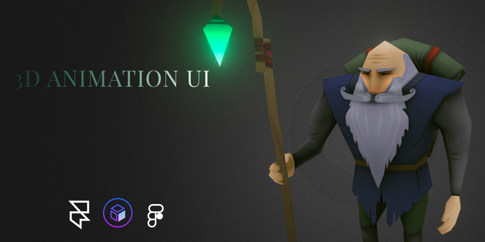

  

 
<i>3D Animation UI Design using <a href="https://www.figma.com/">Figma💕</a>, <a href="https://framer.com/">Framer🔥</a> &<a href="https://sketchfab.com/"> Sketchfab⚡</a>  </i>
  

## Insights🔎
- 3D UI design is inspired by <a href="https://www.youtube.com/watch?v=xk-ihmSbtZs&t=474s">Punit Chawla </a>. It's a simple UI design which covers 3D tools and components.
- This one page design mainly focuses on prototyping using 3D tools and models🤩. 
- Design is covered by 3 amazing tools, Figma & Framer(for design and prototype) along with sketchfab(3D models and design source).
  

## Customize & Use✌️
- Even if you have no idea about 3D design, I'll highly recommend you using these tools atleast for once(specially Framer, if you have enough knowledge about prototyping tools🥳).
- <b>P.S. It might seem too many steps ahead but it's a very simple and easy to do process. Just go for it.</b>😎
  ### In Figma🎯
  - Make basic layout of any device you want to use( I used iPhone 11 max pro). Make one rectangle(this will be the area where your 3D model will run) inside this device of any width and height you want to keep(Mine - 396x439).
  - For running your 3D model inside this rectangle we'll need a figma plugin which will add our HTML, CSS and JS code to link it with this rectangle. Go to Plugins -> Search 'Anima' -> Install.
  - Come back to figma design. Click on menu -> Go to plugins -> click on 'Anima'. You'll see a small window of this plugin on your screen.
  - For running this 3D model, we'll need 3D design code. Now, go to <a href="https://codepen.io/elliezen/pen/yMqqWe">Three.js Saturn</a>.  
  - Click on the rectangle and after that on Anima's screen click on 'Embed Code'. Copy the HTML code from Three.js and paste it into the 'Selected Frame' of Anima. Copy the CSS code from the same wesbite and paste it just below your HTML code in Anima inside . Copy the JS and paste it below CSS code inside 
  - On Anima where you pasted HTML and CSS, click on 'Website' given below and write 'script' tag. Go to Three.js, click on Setting icon and on left side click to JS. You'll find 2 links. Copy 1st one and paste in src = " --link here-- "of script tag, similarly write another script tag and paste 2nd link into that.
  - Click on 'Save'. Click on 'Preview in Browser'(Be patient). And walla!🤩 3D animation has been incorporate inside your rectangle.
  
  ### In Framer🎯
  - On your <a href="https://framer.com/">Framer</a> dashboard you'll find an option of 'Import'. Click on 'Figma'. If this is your first project on framer then you'll need to authenticate framer by figma(just a few seconds work). After authentication, copy your figma project link and paste it there.
  - If all of your design components seems to be imported correctly then you're doing greate otherwise just check your previous steps.
  - Click on 'Insert'. Go to 'Publick Packages' and search for <b>Sketchfab</b>. Click on 'Install', then on 'Show'.
  - You'll see a default 3D model which you can adjust accordingly.
  - Go to <a href="https://sketchfab.com/"> Sketchfab</a>. Search for <a href="https://sketchfab.com/3d-models/cartoon-woman-hip-hop-dance-7da900c6c5bf45c4b6d2ef19f0cab86d">'Cartoon Women Hip-Hop Dance'(or just click here)</a>(if you want exact same model as I used). Click on the model. Don't panick if you see this as a paid model, we can use it free for our personal projects. There are various options provided by sketchfab to use 3D models, we are going to use the one method which I call it as 'Unique Id Method'.
  - Copy the unique Id or numbers you see after name of the animation in the URL(which is 7da900c6c5bf45c4b6d2ef19f0cab86d).
  - Go back to Framer.
  - Click on that default 3D model. You'll find bunch of options on the right side, find 'ID'. Paste the unique Id(copied from sketchfab) inside the 'ID'.
  - BE PATIENT.
  - You can set different options for the animation(I only set 'Autostart as True').
  - Take this animation "inside" the rectangle and expand it accordingly to hide other options that are onto the animation.
  - Tada!!!🕺💃 Nice and Clean 3D animation inside your UI design.
  
  ### Prototype👀
  

  

### Inside Framer⚡
- You can see this design inside Framer - <a href="https://framer.com/share/pDFA9V6DGSBTTd8BvRcT/EtAshFiEO4W1zqqyj5vn4v-7%3A0094md16fctdg"> 3d Animation UI</a>.
- Make your own 3D UI design🤝. Cheers🔥.

  
  
  

  
  
  

